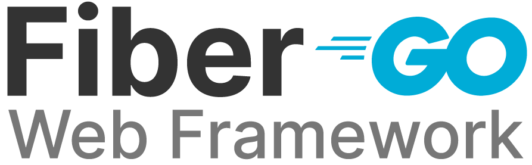
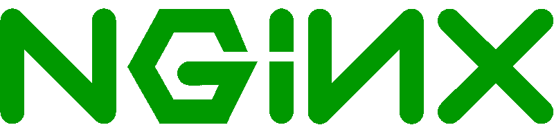
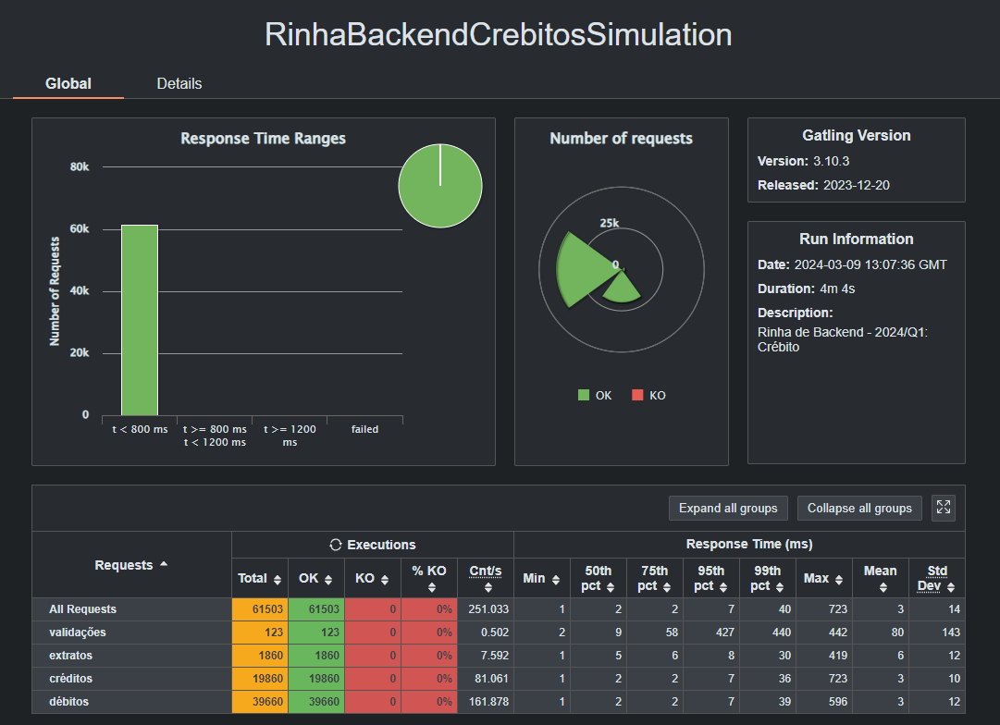

##  Submissão para Rinha de Backend, Segunda Edição: 2024/Q1 - Controle de Concorrência 

## Submissão feita com:

 |  |  |   |
|--|--|--|

- `Golang > Fiber` API
- `nginx` Load Balancer
- `postgres` Banco de dados

 [Repositório da API](https://github.com/mangar/rinha-de-backend-2024-q1-go)

## Test Result

## Autor

- [@mangar](https://twitter.com/mangar) @ twitter
- [@marciomangar](https://www.linkedin.com/in/marciomangar/) @ linkedin